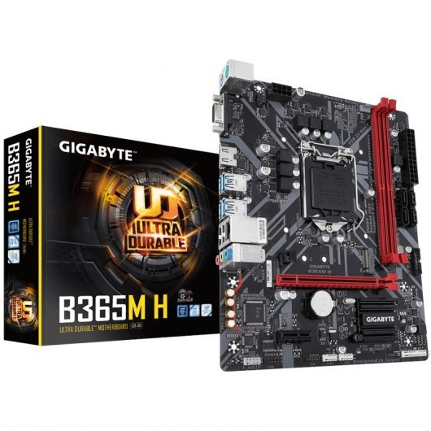
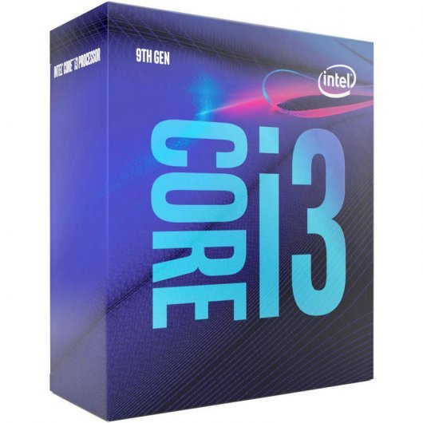
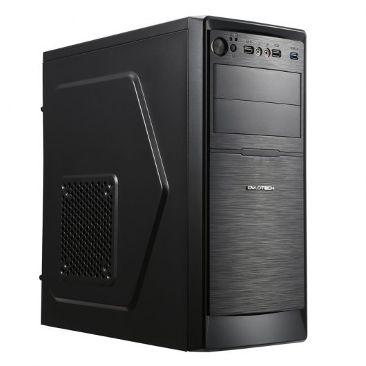
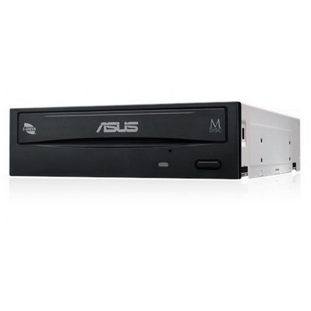
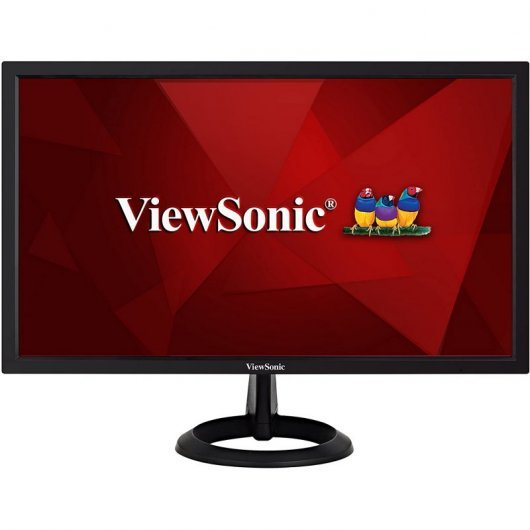
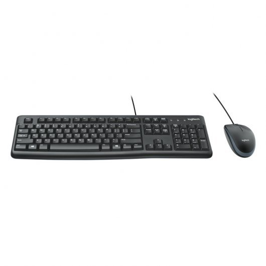
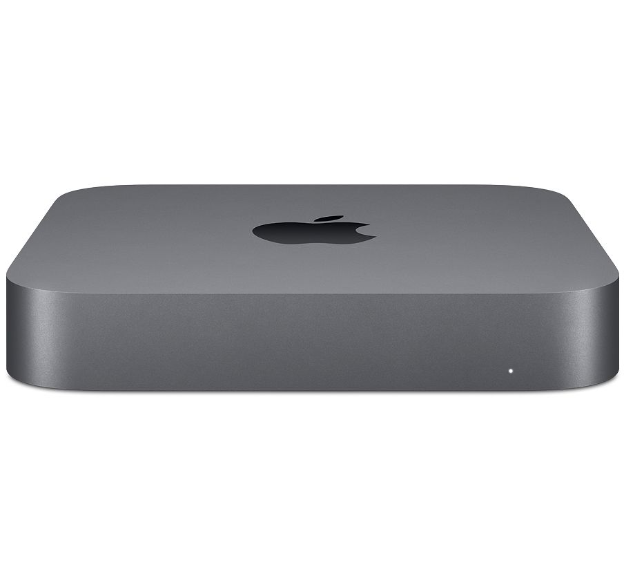

# Pressupost per un ordinador per a desenvolupador web i aplicacions per a mòbils

## 1.Tria i pressupost dels elements

### 1.1.Elements de l'ordinador

|                             Imatge                                               |       Component            |     Preu       |
|:--------------------------------------------------------------------------------:|:--------------------------:|:--------------:|
| | [Placa base Gigabyte B365M H](https://www.pccomponentes.com/gigabyte-b365m-h) |  65.99€ | 
| | [Processador Intel Core i5-9400F 2.9GHz](https://www.pccomponentes.com/intel-core-i3-9100-36-ghz) | 129.91€ | 
| |[2 X Memòries RAM Kingston HyperX Fury Black 8GB DDR42666Mhz PC-21300 CL16](https://www.pccomponentes.com/kingston-hyperx-fury-black-8gb-ddr4-2666mhz-pc-21300-cl16) | 74€ |
| | [Disc dur SSD Samsung 860 EVO Basic SSD 500GB SATA3](https://www.pccomponentes.com/samsung-860-evo-basic-ssd-500gb-sata3) |  76€ | 
| | [Torre Owlotech EVO USB 3.0 500W](https://www.pccomponentes.com/owlotech-evo-usb-30-500w) |  34.99€ | 
| | [Disquetera Asus DRW-24D5MT Grabadora DVD 24X Negra](https://www.pccomponentes.com/asus-drw-24d5mt-grabadora-dvd-24x-negra) | 18.49€ | 

### 1.2.Elements de l'ordinador

|           Imatge              |                                  Periferic                                                     |  Preu    |
|:-----------------------------:|:----------------------------------------------------------------------------------------------:|:---:|
| | [2 x Monitor Viewsonic VA2261-2 21.5" LED FullHD](https://www.pccomponentes.com/viewsonic-va2261-2-215-led-fullhd) | 159,98€ | 
| | [Teclat i ratolí Logitech Desktop MK120](https://www.pccomponentes.com/logitech-desktop-mk120) | 16.99€ | 
| | [Ordinador de producció Mac Mac mini](https://www.apple.com/es/shop/buy-mac/mac-mini) | 929€ |

## 2.Descripció de les característiques dels elements

### 2.1.Placa Base
Placa base marca Gigabyte amb les següents característiques.

    • Fabricant del procesador: Intel
    • Socket del procesador: LGA 1151 (Zócalo H4)
    • Procesador compatible: Intel® Celeron®, Intel® Core™ i3, Intel Core i5, Intel Core i7,
        Intel Core i9, Intel® Pentium®
    • Nombre màxim de procesador SMP: 1
    • Tipus de memòria compatibles: DDR4-SDRAM
    • Nombre de ranures de memòria: 2
    • Tipus de ranures de memòria: DIMM
    • Velocitats de rellotje de memòria soportades: 2133,2400,2666 MHz
    • Memòria interna màxima: 32 GB
    • Canals de memòria: Dual
    • Memòria sense buffer: Si
    • Ample: 226 mm
    • Profunditat: 185 mm
### 2.2.Processador
Processador de marca Intel, model i5-9400F.

    • Frecuencia del procesador: 2.9Ghz
    • Número de núcleos de procesador: 6
    • Litografía del procesador: 14 nm
    • Número de filamentos de procesador: 6
    • Serie del procesador: 9th Generation Intel Core i5 Processors
    • Caché del procesador: 9 MB
    • Frecuencia del procesador turbo: 4,10 GHz
    • Tipos de bus: DMI3
    • Procesador nombre en clave: Coffee Lake
    • Socket 1151

### 2.3 Memòria RAM
Memòria RAM de 16GB (8X2) marca Kingston, model HyperX Fury Black.

    • Capacidades Individuales: 4 GB, 8 GB y 16 GB
    • Kits de 2: 8 GB, 16 GB y 32 GB
    • Kits de 4: 16 GB, 32 GB y 64 GB
    • Frecuencias 2400MHz, 2666MHz, 3000MHz, 3200MHz, 3466MHz
    • Latencias CL15, CL16
    • Voltaje 1,2V, 1,35V
    • Temperaturas de funcionamiento De 0 °C a 85 °C

### 2.4 Disc dur
Disc dur SSD marca Samsung, model 800 EVO basic.

    • Capacidad: 500 GB.
    • Formato: 2.5 pulgadas
    • Interfaz: SATA 6Gb / s (compatible con SATA 3Gb / sy SATA 1.5Gb / s)
    • Dimensiones: 100 X 69.85 X 6.8 (mm)
    • Peso: 50.0g
    • Controlador: Samsung MJX 512 MB
    • Memoria caché: LPDDR4
    • Lectura secuencial: Hasta 550 MB / s. El rendimiento puede variar según el hardware
        utilizado y la configuración.
    • Escritura secuencial: Hasta 520 MB / s. El rendimiento puede variar según el hardware
        utilizado y la configuración.
    • Reproducción aleatoria (4KB, QD32): Hasta 98,000 IOPS. El rendimiento puede variar
        según el hardware utilizado y la configuración.
    • Escritura aleatoria (4KB, QD32): Hasta 90,000 IOPS. El rendimiento puede variar según
        el hardware utilizado y la configuración.
    • Reproducción aleatoria (4 KB, QD1): Hasta 10.000 IOPS. El rendimiento puede variar
        según el hardware utilizado y la configuración.
    • Escritura aleatoria (4KB, QD1): Hasta 42,000 IOPS. El rendimiento puede variar según
        el hardware utilizado y la configuración.
    • Consumo de energía: promedio: 2.2 W. Máximo: 3.3 W (modo de ráfaga). El consumo
        de energía real puede variar según el sistema del equipo utilizado y la configuración.
    • Fiabilidad (MTBF): 1,5 millones de horas (MTBF)
    • Temperatura de funcionamiento: 0 - 70 C

### 2.5 Torre
Torre marca Owlotech model EVO

    • Puertos: 1xUSB 3.0, 2xUSB 2.0
    • Medidas (mm): 400x180x420
    • Peso: Neto 3.2KG, Bruto 3.7KG
    • Compatibilidad placas ATX, Micro ATX, ITX
    • Bahías: 2 x 5.25",2 x 3.5", 1 x SSD
    • Ventilación: 1 x 9cm (incluido), 1 x 12cm lateral (opcional)
    • Fuente de alimentación: Fuente 500W (incluida)
    • Tamaño máximo del disipador de la CPU 150mm
    • Tamaño máximo de la tarjeta gráfica 350mm
    
 ### 2.6 Disquetera
Disquetera marca Asus, model DRW-24D5MT

    • Requisitos del sistema
    • Sistema operativo Windows soportado: Si
    • Ancho: 146 mm
    • Profundidad: 170 mm
    • Altura: 41 mm
    • Peso: 700 g
    • Intervalo de humedad relativa para funcionamiento: 20 - 80%
    • Intervalo de temperatura operativa: 5 - 45 °C
    • Intervalo de temperatura de almacenaje: -20 - 60 °C
    • Intervalo de humedad relativa durante almacenaje: 15 - 90%
    • DVD, tiempo promedio de acceso: 145 ms
    • Unidad CD-ROM tiempo promedio de acceso: 125 ms

### 2.7 Monitor
 Monitor marca Viewsonic model VA2261-2

    • Full HD 1080p para un rendimiento de píxeles superior
    • Brillo de la pantalla (típico): 200 cd / m²
    • Resolución de la pantalla: 1920 x 1080 Pixeles
    • Relación de aspecto nativa: 16:9
    • Tiempo de respuesta: 5 ms
    • Tipo HD: Full HD
    • Tecnología de visualización: LED
    • Número de colores de la pantalla: 16,78 millones de colores
    • Consumo energético: 20 W
    • Consumo de energía (inactivo): 0,5 W
    • Voltaje de entrada AC: 100 - 240 V
    • Frecuencia de entrada AC: 50/60 Hz

### 2.8 Teclat i ratolí

Pack de teclat i ratolí marca Logitech model MK120.

### 2.9 Ordinador de producción Mac (Mac Mini)

Ordinador Mac marca Apple, concretamente el model MAC mini

    • Intel Core i3 de cuatro núcleos a 3,6 GHz de octava generación
    • 8 GB de memoria DDR4 a 2.666 MHz
    • Intel UHD Graphics 630
    • Almacenamiento SSD PCIe de 256 GB 

## 3.Justificació del pressupost
### 3.1.Placa Base
 Hem triat la placa base Gigabyte B365M H ja que és Micro ATX, compatible amb la torre que hem escollit.
### 3.2.Processador
 Sobre el procesador, hem optat per un Intel Core i5-9400F de 2.9GHz. Creiem que amb un Intel Core i3 haguès sigut suficient, però degut a que ens sobraven diners del pressupost, hem optat per invertir en un procesador millor, en aquest cas un i5 de 9ª generació.
### 3.3 Memòria RAM
Hem tirat per 16GB de memòria RAM (separades en dues de 8GB). Creiem que amb 8GB n’haguessim tingut de sobres per execurar els programes plantejats en l’enunciat, però ja que ens sobraven diners del pressupost, hem decidit donar preferència a la memòria a l’hora d’invertir aquests diners.
### 3.4 Disc Dur
La nostra el·lecció de disc dur ha estat la SSD Samsung 860 EVO Basic SSD 500GB SATA3. Hem escollit SSD per a poder obrir de la forma més ràpida possible l’ordinador i tots els programes.
### 3.5 Torre + Font d'alimentació
 L’aspecte que ens ha cridat més l’atenció de la torre ha estat el fet de que ja portés una Font d’alimentació de 500W incorporada, més que suficient per els components que hem escollit, i més tenint en compte que no hem inclòs tarjeta gràfica (i per tant el consum no és tant elevat). Per tant ens hem quedat amb la torre marca Owlotech EVO.
### 3.6 Disquetera
 La torre escollida no inclou disquetera, i hem decidit afegir-ne una dins del pressupost (per poder instalar el sistema operatiu). No hem tingut gaires miraments a l’hora d’escollir la disquetera, i ens hem decantat per a més económica, en aquesta cas la Asus DRW-24D5MT Grabadora DVD 24X Negra.
### 3.7 Monitor
Hem escollit el monitor Viewsonic VA2261-2 21.5" LED FullHD (1920 x 1080) ja que té una resolució superior a la que demanaven els requisits dels programes per desenvolupar. Inicialment vam incloure només un monitor, però veient que pot ser d’útil un segon monitor a l’hora de desenvolupar web i aplicacions per a mòbils.
### 3.8 Teclat + Ratolí
En el cas del teclat i ratolí, hem seguit el mateix criteri econòmic que amb la disquetera, i hem escollit un pack de teclat+ratolí per fer-ho encara més barat.
### 3.9 Mac    
 A l’hora d’escollir el nostre ordinador de producción Mac, haguéssim pogut escollir ordinadors Mac més potents, però per els programes que hem d’utilitzar, amb el MAC mini de 8GB de memòria, amb processador i3 de 4 nuclis i SSD DE 256GB n’estem més que satisfets.
