# Pressupost 2. Gamer.

## **Configuració de l'ordinador**

| Imatge |  | Nom | Preu | | Característiques | | Motiu elecció
|---------|---------|---------|---------|---------|---------|---------|---------|
| 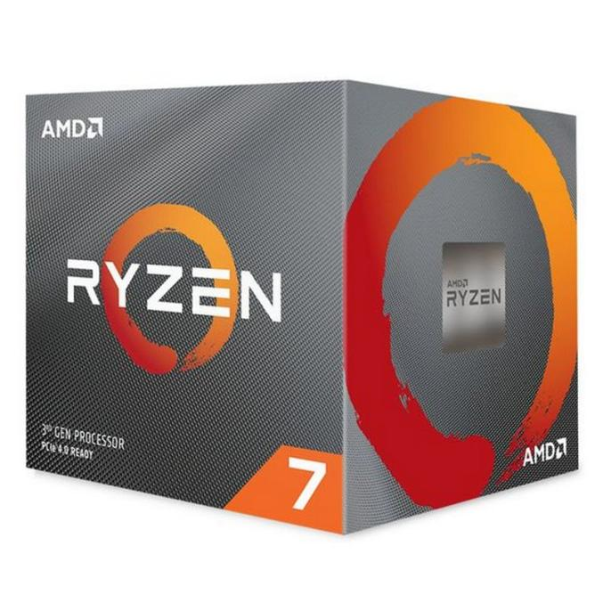 | **Processador** | <a href="https://www.pccomponentes.com/amd-ryzen-7-3700x-36ghz-box"> AMD Ryzen 7 3700X 3.6GHz BOX </a> | 319,90€ | |  Socket: AM4    Nuclis: 8    Fils: 16    Velocitat: 3.6GHz    || Els processadors AMD Ryzen son molt bons per a ordinadors d'aquest tipus. Aquest processador era el millor per al pressupost que teníam.
| 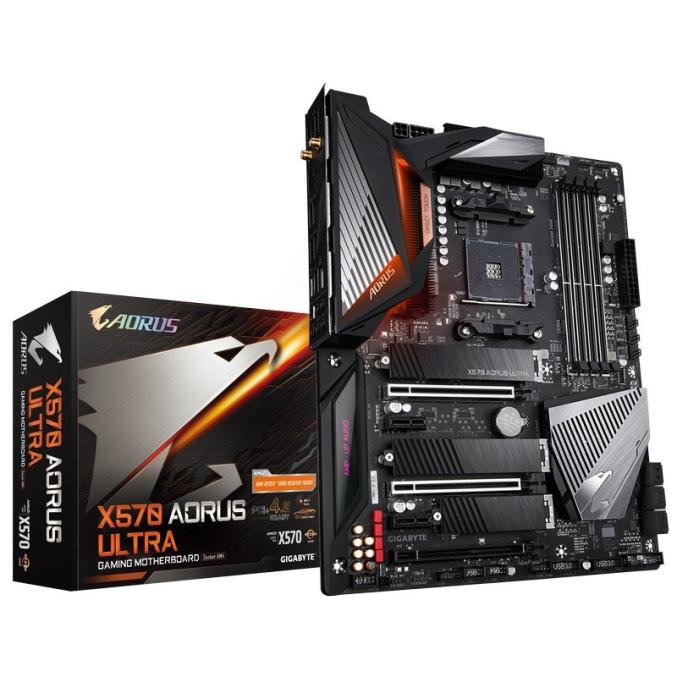 | **Placa Base** | <a href="https://www.pccomponentes.com/gigabyte-x570-aorus-ultra"> Gigabyte X570 Aorus Ultra </a> | 299,90€ | |  Socket: AM4    Chipset: AMD X570    Tipus: ATX   || Tenía un socket AM4, compatible amb el processador AMD Ryzen 7 i d'una marca coneguda. Ademés, era la més potent que ens podíam permetre sense disparar el preu.
| 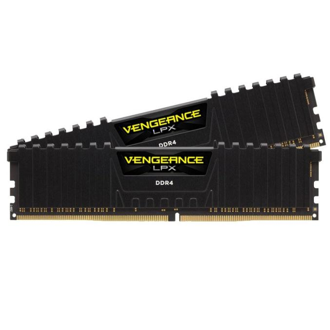 | **Memoria RAM** | <a href="https://www.pccomponentes.com/corsair-vengeance-lpx-ddr4-3200-pc4-25600-32gb-2x16gb-cl16"> Corsair Vengeance LPX DDR4 3200 PC4-25600 32GB 2x16GB CL16 </a> | 154,99€ | |  Memoria interna: 32GB    Tipus de memoria interna: DDR4    || Corsair es una marca molt popular per a RAMS. 32GB es més que suficient per jugar sense problemes.
  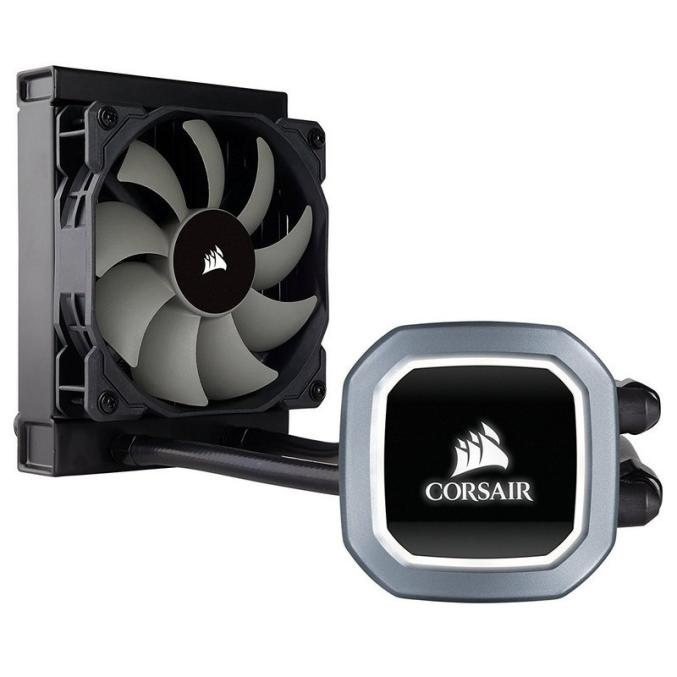 | **Ventilador CPU** | <a href="https://www.pccomponentes.com/corsair-hydro-h60-kit-de-refrigeracion-liquida"> Corsair Hydro H60 Kit de Refrigeración Líquida | 79,94€ ||  -Socket: AM4    -Chipset: AMD X570     || Corsair es bona marca en general i dona confiança. Té refrigeració líquida.
| 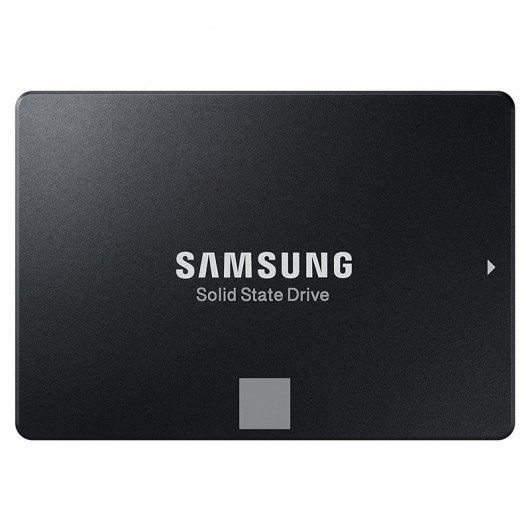 | **Disc dur 1** | <a href="https://www.pccomponentes.com/samsung-860-evo-basic-ssd-500gb-sata3"> Samsung 860 EVO Basic SSD 500GB SATA3 </a> | 76€ |  |  Capacitat: 500 GB.    Tipus: SSD   || Es una SSD de 500GB, suficient per el sistema i algún joc que necessiti més rendiment.
  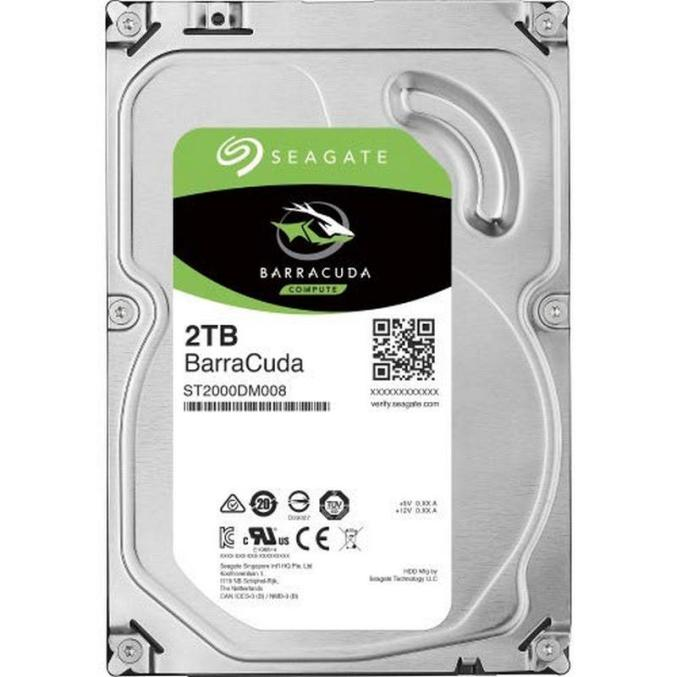 | **Disc dur 2** | <a href="https://www.pccomponentes.com/seagate-barracuda-35-2tb-sata-3"> Seagate BarraCuda 3.5" 2TB SATA 3 </a> | 56,98€ ||  Capacitat: 2000 GB    Tipus: HDD     || 2TB son més que suficients per altres arxius o jocs menys exigents. Els Seagate BarraCuda son els millors HDDs en quant a calitat-preu.
| 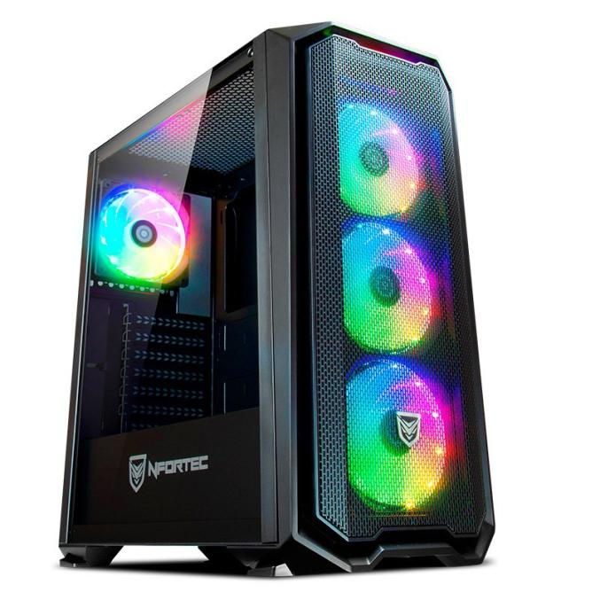 | **Torre** | <a href="https://www.pccomponentes.com/nfortec-krater-cristal-templado-usb-30-argb-negro"> Nfortec Krater Cristal Templado USB 3.0 ARGB Negro </a> | 79,90€ | |  Ventilador: 3     || Ens ha agradat visualment i suporta plaques base ATX.
  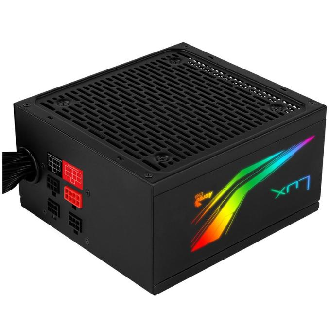 | **Font d'alimentació** | <a href="https://www.pccomponentes.com/aerocool-lux-650m-rgb-650w-bronze-semi-modular"> Aerocool LUX 650M RGB 650W Bronze Semi-Modular </a> | 59,98€ | |  Potencia Total: 650W    || Bastanta potencia i té conector ATX. També ens ha agradat visualment. 
| 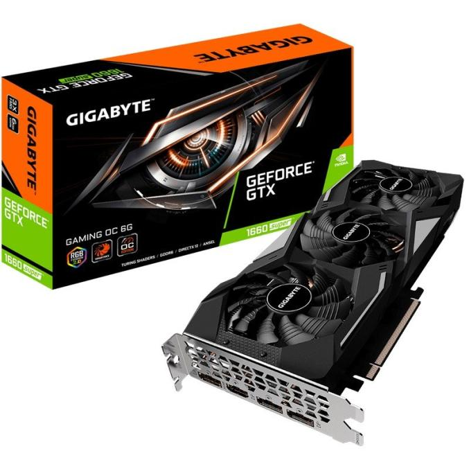 | **Targeta gràfica** | <a href="https://www.pccomponentes.com/gigabyte-geforce-gtx-1660-super-gaming-oc-6gb-gddr6"> Gigabyte GeForce GTX 1660 Super Gaming OC 6GB GDDR6 </a> | 255,90€ ||  Memoria: 6GB    | |Les gràfiques GeForce GTX son de les millors que hi ha per a jugar. Aquesta en concret es la millor que ens podíam permetre sense disparar el pressupost.
  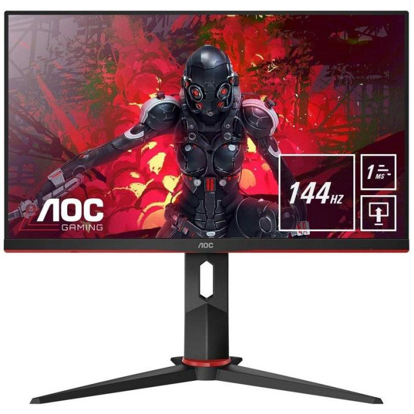 | **Monitor** | <a href="https://www.pccomponentes.com/aoc-gaming-24g2u-24-led-ips-fullhd-144hz-freesync"> AOC Gaming 24G2U 24" LED IPS FullHD 144Hz FreeSync </a> | 189,99€ | |  Resolución 1920x1080 PX     Frecuencia: 144 Hz   || Es un monitor bastant potent que té la resolució necessitada per a poder jugar sense problemes.
| 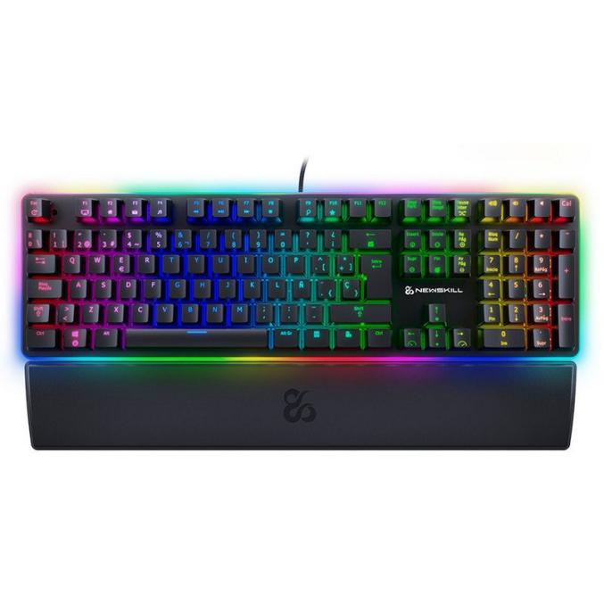 | **Teclat** | <a href="https://www.pccomponentes.com/newskill-suiko-teclado-mecanico-gaming-full-rgb-switch-kailh-red"> Newskill Suiko Teclado Mecánico Gaming Full RGB Switch Kailh Red </a> | 69,95€ | | ||Es mecànic i ens ha agradat visualment.
  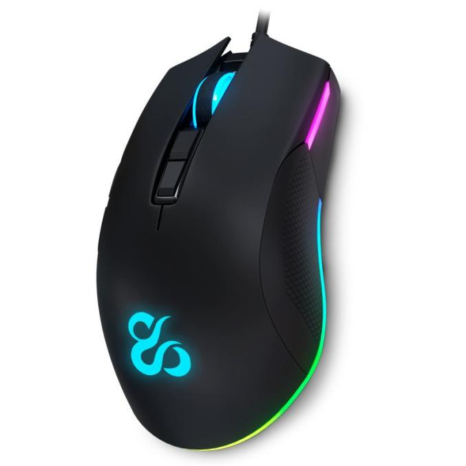 | **Ratolí** | <a href="https://www.pccomponentes.com/newskill-eos-raton-gaming-professional-rgb-16000dpi"> Newskill EOS Ratón Gaming Professional RGB 16000DPI| 49,95€ </a> | |-DPI: 16000 | |Ens ha agradat visualment.
  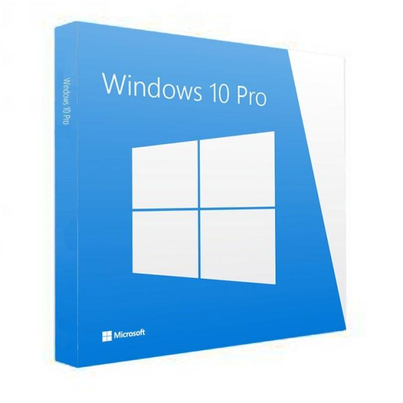 | **Sistema Operatiu** | <a href="https://www.pccomponentes.com/microsoft-windows-10-pro-standard-32-64bits-requiere-montaje-pccom-instalacion-so"> Microsoft Windows 10 Pro Standard 32/64Bits </a> | 132 € | | ||Per a jugar es necessari un Windows, ja que molts jocs no funcionen en altres sistemes operatius.

 
 

### **Preu final**

* **Components**
  * Processador: 319,90€
  * Placa base: 299,90€
  * RAM: 154,99€
  * Ventilador: 79,94€
  * Disc dur: 76€
  * Disc dur 2: 56,98€
  * Caixa: 79,90€
  * Alimentació: 59,98€
  * Gràfica: 255,90
  * **Total:** 1383,49€
  
* **Periférics**
  * Monitor: 189,99€
  * Teclat: 69,95€
  * Ratolí: 49,95€
  * **Total:** 309,89€
  
* **Sistema Operatiu**
  * Microsoft Windows 10 Pro Standard
  * **Total:** 132€

* **TOTAL:** 1825,38€
   
   
  **Preus agafats a data 22/10/2020**
