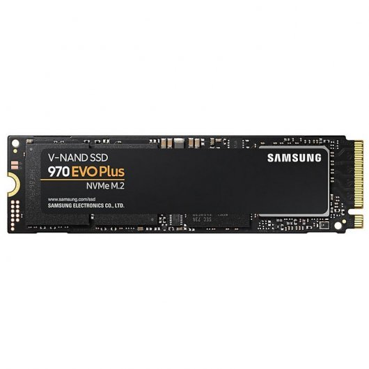

<link rel="stylesheet" href="css/style.css">

# Pressupost PC Disseny 2D

| Imatge | Nom  | Quantitat | Preu   |
| ------- | ------- |:-------:|:-------:|
| | [Intel Core I7-9700F](https://www.pccomponentes.com/intel-core-i7-9700f-3ghz) | 1 |259,90€ |
| | [Gigabyte Z390 Gaming X](https://www.pccomponentes.com/gigabyte-z390-gaming-x) | 1 | 132,89€ |
| | [Kingston HyperX Fury Black 2666Mhz 16GB 2X8](https://www.pccomponentes.com/kingston-hyperx-fury-black-16gb-ddr4-2666mhz-pc-21300-2x8gb-cl16) | 1 | 70€ |
| | [Corsair H100i RGB PLATINUM Refrigeración Líquida](https://www.pccomponentes.com/corsair-h100i-rgb-platinum-kit-de-refrigeracion-liquida) | 1 | 137,90€ |
| | [Samsung 970 EVO Plus 500GB SSD NVMeM.2](https://www.pccomponentes.com/samsung-970-evo-plus-500gb-ssd-nvme-m2) | 1 | 109,99€ |
| | [Seagate BarraCuda 3.5" 2TB SATA 3](https://www.pccomponentes.com/seagate-barracuda-35-2tb-sata-3) | 1 | 56,98€ |
| | [NOX Hummer Fusion Cristal Templado USB3.0](https://www.pccomponentes.com/nox-hummer-fusion-cristal-templado-usb-30) | 1 | 69,99€ |
| | [CorsairRM750 750W 80 Plus Gold Full Modular](https://www.pccomponentes.com/corsair-rm750-750w-80-plus-gold-full-modular) | 1 | 114,99€ |
| | [EVGA GeForce RTX 2060 KO GAMING 6GB GDDR6](https://www.pccomponentes.com/evga-geforce-rtx-2060-ko-gaming-6gb-gddr6) | 1 | 299,90€ |
| **Total**  |         |        | 1252,54€ |

   

## Periferics

| Imatge | Nom | Quantiat | Preu|
| ------ |----|:--------:|:---:|
|  | Monitor Asus VZ279HE-W 27" LED IPS FullHD | 1 | 227,58€|
|  | Logitech G203 Prodigy Ratón Gaming 8000DPI| 1| 32,28€|
|  | Corsair K55 Teclado USB RGB| 1|59,98€|
|  | Wacom Cintiq Pro 16| 1|1481,78€|
| **Total** |        |        |1801,62€|
   
## Descripció components

**Intel Core I79700F:**  
* **Procesador**
  * Familia de procesador: 9th gen Intel® Core™ i7
  * Frecuencia del procesador: 3 GHz
  * Número de núcleos de procesador: 8
  * Socket de procesador: LGA 1151 (Zócalo H4)
  * Litografía del procesador: 14 nm
  * Número de filamentos de procesador: 8
  * System bus data transfer rate: 8 GT/s
  * Modo de procesador operativo: 64 bits
  * Caché del procesador: 12 MB
  * Frecuencia del procesador turbo: 4,7 GHz  

* **Memoria**
  * Canales de memoria que admite el procesador: Dual
  * Memoria interna máxima que admite el procesador: 128 GB
  * Tipos de memoria que admite el procesador: DDR4-SDRAM
  * Velocidad de reloj de memoria que admite el procesador: 2666 MHz
  * Ancho de banda de memoria soportada por el procesador (max)  
* **Control de energia**
   * Potencia de diseño térmico (TDP): 65 W

**Gigabyte Z390 Gaming X:** 

 * **Chipset**

   * Intel® Z390 Express Chipset

* **Memory**

   * 4 x DDR4 DIMM sockets supporting up to 64 GB of system memory

**Kingston HyperX**
* **Memoria RAM**
  * Frecuencia: 2666MHz
  * Latencia: CL16

**Corsair H100i RGB**
* **Refrigerción liquida** 
  * Dimensiones: 277mm x 120mm x 27mm
  * Velocidad máxima ventiladores: 2400 RPM

* **Samsung 970 EVO Plus 500GB SSD NVMe M.2**
   * SDD, capacidad: 500 GB

    

   * Velocidad de lectura: 3500 MB/s

   * Velocidad de escritura: 3200 MB/s

    
