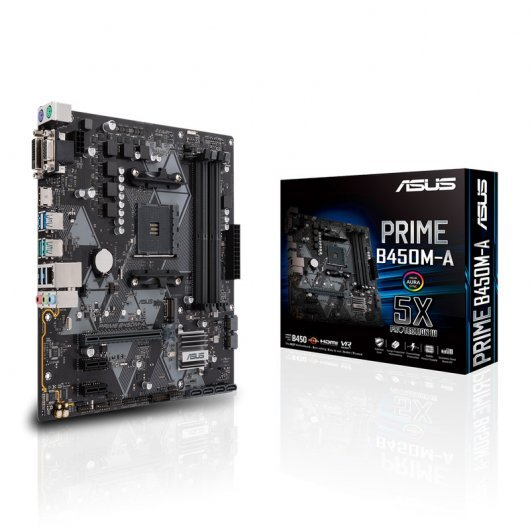
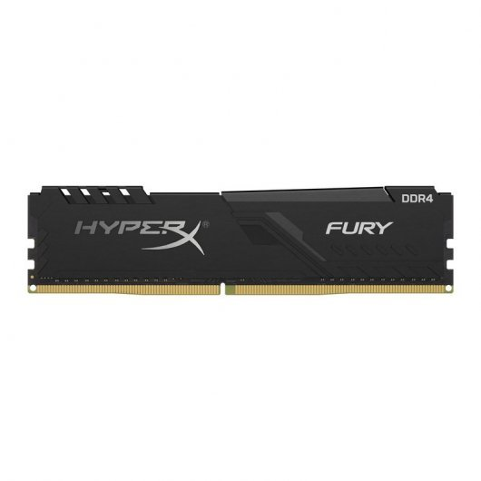

# PRESUPUESTO 3.- ORDENADOR BÁSICO

---

## **Enunciat**

La configuració de l’ordinador de sobretaula d’un membre del personal administratiu d'una institució pública ha de complir les següents especificacions:
- Cal que pugui executar els programes ofimàtics clàssics (editor de text, full decàlcul...).
- També executarà programes de videoconferència (Skype, Google Meet...).
- El pressupost que teniu disponible pels components essencials de l’ordinador (torre) és d’entre 300€ i 400€. Si, per alguna raó, sortiu fora d’aquests marges, ho haureu de justificar.

Addicionalment al pressupost de la torre, afegiu els següents elements:
- Tots aquells perifèrics que cregueu convenients, ajustant el preu al màxim.
- El sistema operatiu que cregueu més adient.

---

<h2 style="font-style: italic; color: #5AE398;"> 1. <u>Elección y presupuesto de los elementos</u></h2>

<h3 style="font-style: italic; color: #63FAEF;"> 1.1. <u>Elementos del ordenador</u></h3>

| IMAGEN   | NOMBRE | PRECIO | 
|:---------|:---------:|:---------:|
| | [AMD Ryzen 3 3200G 3.6 GHz ](https://www.pccomponentes.com/amd-ryzen-3-3200g-36-ghz-box) | `99,99€` |
| | [Asus PRIME B450M-A](https://www.pccomponentes.com/asus-prime-b450m-a) | `73,99€` | 
| | [Kingston HyperX Fury Black 8GB DDR4 3200Mhz ](https://www.pccomponentes.com/kingston-hyperx-fury-black-8gb-ddr4-3200mhz-pc-25600-cl16) | `37€` |
| | [Samsung 860 EVO Basic SSD 500GB SATA3](https://www.pccomponentes.com/samsung-860-evo-basic-ssd-500gb-sata3) | `76€` |
| | [Aerocool CS-105 USB 3.0 Negra](https://www.pccomponentes.com/aerocool-cs-105-usb-30-negra) | `22,99€` |
| | [Nox Urano VX 650W 80+ Bronze](https://www.pccomponentes.com/nox-urano-vx-650w-80-bronze-120mm-pwm) | `49,95€` | 
||| Total: `359,96€`|

<h3 style="font-style: italic; color: #63FAEF ;"> 1.2. <u>Periféricos</u></h3>

| IMAGEN  | NOMBRE | PRECIO | 
|:---------|:---------:|:---------:|
| | [ AOC 24B1H 23.6" LED FullHD Mate ](https://www.pccomponentes.com/aoc-24b1h-236-led-fullhd-mate) |`95,99€`|
| | [ NGS Gaming Pack GBX-1500 ](https://www.pccomponentes.com/ngs-gaming-pack-gbx-1500-teclado-raton-auriculares) |`28,99€`|
| | [ Owlotech Start Webcam 720p ](https://www.pccomponentes.com/owlotech-start-webcam-720p) |`19,99€`|
|||Total: `144,97€`|

<u style="font-weight: bold; font-style: italic; color: #7AFA63"> Monitor </u>
##### Hemos elegido un monitor AOC de 24' 1080p porque tiene una buena resolución ademas de un tamaño correcto para poder estar trabajando sin hacer sufrir a la vista. 

<u style="font-weight: bold; font-style: italic; color: #7AFA63"> Teclado, ratón y auriculares </u>
##### Hemos elegido un pack Gaming de NGS que nos incluye tanto el teclado como el ratón y los auriculares principalmente por la relación calidad precio. Los auricualres serán importantes a la hora de hacer conferencias tanto de audio como de video.
<u style="font-weight: bold; font-style: italic; color: #7AFA63"> Webcam </u>
##### Hemos elegido una de las webcams mas económica sin afectar mucho a la calidad de imagen. Ya que solamente se usará para hacer videollamadas.

   
<h2 style="font-style: italic; color: #5AE398;"> 2. <u>Descripción de las características de los elementos</u></h2>

<h3 style="font-style: italic; color: #63FAEF ;"> 2.1. <u>Placa base</u></h3>

<u style="font-weight: bold; font-style: italic; color: #7AFA63"> Asus PRIME B450M-A </u>

* ##### Socket AMD AM4  
* ##### Procesadores compatibles: AMD Ryzen 3, Ryzen 5, Ryzen 7
* ##### Tamaño: Micro-ATX

<h3 style="font-style: italic; color: #63FAEF ;"> 2.2. <u>Procesador</u></h3>

<u style="font-weight: bold; font-style: italic; color: #7AFA63"> AMD Ryzen3 3200G 3.6GHz </u>
* ##### Núcleos: 4
* ##### Hilos: 4
* ##### Modelo de graficos: Radeon vega 8 Graphics
* ##### TDP: 65W
  
<h3 style="font-style: italic; color: #63FAEF ;"> 2.3. <u>RAM</u></h3>

<u style="font-weight: bold; font-style: italic; color: #7AFA63"> Kingston HyperX Fury Black 8G </u>
* ##### Capacidad: 8GB DDR4
* ##### Frecuencia: 3200 MHz
* ##### Latencia: CL 16
* ##### Temperaturas de funcionamiento: De 0ºC a 85ºC
<h3 style="font-style: italic; color: #63FAEF ;"> 2.4 <u>SSD</u><h3 style="font-style: italic; color: #63FAEF ;"></h3>
<u style="font-weight: bold; font-style: italic; color: #7AFA63"> Samsung 860 EVO Basic SSD 500GB </u>

 * ##### Capacidad: 500 GB
 * ##### Formato: 2.5 pulgadas
 * ##### Interfaz: SATA 6gbps
 * ##### Velocidades: 
   * ##### Lectura secuencial: Hasta 550 MB/s
   * ##### Escritura Secuencial: Hasta 520 MB /s
  <h3 style="font-style: italic; color: #63FAEF ;"> 2.5. <u>Fuente de alimentación</u></h3>
<u style="font-weight: bold; font-style: italic; color: #7AFA63"> Nox Urano VX 650W 80+ Bronze </u>

  * ##### Certificado 80+ Bronze
  * ##### Ventilador de 120mm con PWM
  * ##### Potencia nominal: 650W
  * ##### Voltaje de entrada: 240
  * ##### Eficiencia: 85%
  * ##### Conectores
    * ##### 1x ATX MB 20+4 pines
    * ##### 1x EPS +12V 4+4 pines
    * ##### 1x PCIE 6+2 pines, 60cm
    * ##### 1x PCIE 6+2 pines, 75cm
    * ##### 2x SATA, 60cm
    * ##### 2x SATA, 75cm
    * ##### 2x SATA, 90cm
    * ##### 1x Molex 4 pines, 60cm
    * ##### 1x Molex 4 pines, 75cm
    * ##### 1x FDD, 90cm

<h2 style="font-style: italic; color: #5AE398 ;"> 3. <u>Justificación del presupuesto</u></h2>

En este presupuesto, hemos decidido escoger los componentes anteriormente mencionados, porque pensamos que para un ordenador básico y doméstico, realmente no hace falta mas potencia en cuanto a componentes, para correr los programas que mencionaba el presupuesto y además lleva un disipador bastante bueno.

Asi que de procesador hemos escogido un ryzen 3 3200G porque como he dicho anteriormente no necesitamos una CPU que tenga que correr muchos programas a la vez o uno muy potente.

 Asi que en consecuencia a esa razón, la placa base que necesitabamos no tenia que ser muy buena asi que escogimos una opcion economica, que cumpliera con el socket de la CPU.

  Asi mismo tambien hemos puesto una RAM de 8GB de kingston y solo un slot, porque al poner 2 slots de 4GB a la hora de actualizarlo, a lo mejor pierdes esas targetas por tener poca memoria. 
  
  Le hemos puesto tambien un SSD SATA de samsung, ya que da muy buenos resultados y asi ira rapidisimo a la hora de abrir o ejecutar programas, a parte de que al ser un ordenador domestico, no necesitamos una gran capacidad de almacenamiento.

  Como caja, hemos escogido una aerocool bastante barata y incluye ventiladores, asi que las temperaturas serán mas frías.

  Y finalmente, como fuente hemos escoogido una Nox de 650 W con certificacion 80+ Bronze, y si, aunque sea mucha potencia para un ordenador tan básico, hoy en dia no se suelen encontrar muchas con menos potencia y las que hay, valen mas o menos lo mismo que esta. Asi que ya que estabamos le hemos puesto esta porque si en un futuro se quiere actualizar el ordenador, la fuente va a poder soportar la potencia que consuman los componentes del ordenador.

  <u>
Precio obtenido el dia 21/10/2020
</u>
  <u>
<a href="https://www.pccomponentes.com/configurador/Ce002bC0B" style="font-weight: bold;  font-style: italic; color: #67FD72;">PcComponentes</a>
</u>
