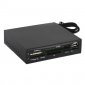

# Pressupost 4 - Compositor i productor

---

## **Enunciat**

La configuració de l’ordinador de sobretaula d’un compositor i productor de música electrònica ha de complir les següents especificacions:
- Ha de poder executar programes d’edició de música com Ableton Live, FL Studio iCubase.
- S’hi ha de poder connectar un teclat sintetitzador com, per exemple, el Yamaha PSR-S970 (no s’ha d’incloure en el pressupost).
- El pressupost que teniu disponible pels components essencials de l’ordinador (torre) és d’entre 500€ i 900€. Si, per alguna raó, sortiu fora d’aquests marges, ho haureu de justificar.

Addicionalment al pressupost de la torre, afegiu els següents elements:
- Tots aquells perifèrics que cregueu convenients, ajustant el preu al màxim (tingueu en compte que es desitja una bona qualitat de so).
- El sistema operatiu que cregueu més adient.

---

## 1. Components

 

| Imatge | Nom | Preu | Descripció | Justificació |
| ------ | --- | ---- | ---------- | ------------ |
|  | [AMD Ryzen 5 3600](https://www.pccomponentes.com/amd-ryzen-5-3600-36ghz-box) | 202,90€ | Nuclis de CPU: 6 Cores / 12 fils   Frequéncia de CPU 3.6GHz fins 4.2GHz en turbo | El millor processador calitat/preu que hem trobat i amb suficiència potència per poder correr tot allò que faigi falta
|  | [MSI B450 Gaming Plus MAX](https://www.pccomponentes.com/msi-b450-gaming-plus-max) | 97,99€ | Socket AM4 Chispet AMD B450 Format ATX Audio de 8 canals (7.1) Audio HD amb reforç de sò Compte amb les tecnologies: Core Boost, Audio Boost, DDR4 Boost | La placa l'hem agafat per el chip de sò integrat que porta ja que és de bona calitat i ens anirà molt be per els perifèrics que tenim
|  | [Kingston HyperX Fury Black](https://www.pccomponentes.com/kingston-hyperx-fury-black-16gb-ddr4-3200mhz-pc-25600-2x8gb-cl16) | 70€ | 16GB DDR4 3200Mhz (2x8GB) CL16 |Ram suficient per poder utilitzar moltes finestres a la vegada
|  | [Corsair Cooling Hydro Series H45](https://www.pccomponentes.com/corsair-cooling-hydro-series-h45) | 41,99€ | Disipador liquid amb un radiador de 120mm |L'hem escollit per evitar que la CPU no s'ens recalenti massa i no sufrim el problema de thermal throttling
|  | [Kingston A200 M.2](https://www.pccomponentes.com/kingston-a2000-m2-500gb-pci-express-30-nvme) | 67,33€ | Kingston M.2 de 500GB PCI-Express NVMe Velocitat de lectura/escritura: 2.200/2.000MB/s |Disc per el S.O i totes aquelles aplicacions que necessitin a part de les dades més utilitzades i tenir'les a ràpid accés
|  | [Segate BarraCuda 3.5" 1TB SATA3](https://www.pccomponentes.com/seagate-barracuda-35-1tb-sata3) | 35,95€ | Velocitat de rotació 7200RPM   Tamany de 3.5"   Tamany búfer de 64MB |Disc dur per a guardar tots aquells projectes acabats o altres tipus de documents
|  | [MSI MAG Forge 100M Cristal Templado RGB](https://www.pccomponentes.com/msi-mag-forge-100r-cristal-templado-usb-32-rgb) | 44,99€ | Capacitat per instalar 6 ventiladors  Controlador de 1 a 6 RGB LED Disseny de vidre templerat de 4mm de gruix de primera calitat Filtre magnètic a la part superior | Caixa amb molt fluxe d'aire per poder treballar amb menys soroll
|  | [EVGA W1 600W 80 Plus](https://www.pccomponentes.com/evga-w1-600w-80-plus) | 49,99 | Tipo de cable no modular  Certificació 80 Plus Silver| Font amb cerfificació 80 plus silver per poder aprofitar el màxim la llum que consumim i no produir molta calor 
|  | [AsRock Phantom Gaming D Radeon RX580](https://www.pccomponentes.com/asrock-phantom-gaming-d-radeon-rx580-oc-8gb-gddr5) | 189,90€ |  Radeon RX580 OC 8GB GDDR5| L'hem escollit per ha tenir sortida de video ja que aquest processador no disposa de GPU integrada i també per ha si algun programa necessita codificar/descodificar que ho faigi més rapid desde la GPU i així li traiem carga de treball a la CPU
|  | [Creative Sound Blaser Audigy RX](https://www.pccomponentes.com/creative-sound-blaster-audigy-rx) | 51€ | Grabacions de sò de latència super baixa| Una targeta de sò de molt alta calitat per a que pugui treballar amb la màxima calitat/nitidesa de sò
|  | [Tacens Anima ACR1](https://www.pccomponentes.com/tacens-anima-acr1-lector-de-tarjetas) | 4,25€ | 6 ports de tarjetes per a més de 68 tipus de targetes| Necessaria per si te algún tipus de camara o altres aparells que guarden les dades en targetes SD
|  | [Asus DRW-24D5MT](https://www.pccomponentes.com/asus-drw-24d5mt-grabadora-dvd-24x) | 16,65€ | Velocitat d'escriptura DVD 24X| Per a poder grabar/reproduir qualsevol tipus de CD/DVD
| | **Preu total:** | **901.60€** |

   

## 2. Perifèrics

 

| Imatge | Nom | Preu | Descripció | Justificació |
| ------ | --- | ---- | ---------- | ------------ |
|  | [BenQ GW2780E 27"](https://www.pccomponentes.com/benq-gw2780e-27-led-ips-eye-care) | 149€ | Pantalla Full HD 27"  Font d' alimentació (90-264 AC)|Necessari per poder veure el ordenador
|  | [Owlotech Combo 101 (Teclat+ Ratoli)](https://www.pccomponentes.com/owlotech-combo-101-teclado-raton-inalambricos) | 16,95€ | Conexió 2.4Ghz, 1 receptor nano per ambdos productes  Resolució: 800/1200/1600 DPI|Necessari per poder interactuar amb el ordenador
|  | [Logitech Z333 Speaker 80W](https://www.pccomponentes.com/logitech-z333-speaker-40w) | 44,99€ | 40 vatts (RMS)/80 vatts cresta  RCA estéreo y 3,5mm|Per poder anar escoltant tot el que produeix amb só de bona calitat     
| | **Preu total:** | **210,94€** |

 

### **Link de la configuració**
[Enllaç de la Configuració del PC](https://www.pccomponentes.com/configurador/D224D3824)

