# Pressupost PC Disseny 2D

<link rel="stylesheet" href="css/style.css">

   

| Imatge | Nom | Quantitat | Preu |
|--------|-----|:---------:|:----:|
|  | [Intel Core I7-9700F](https://www.pccomponentes.com/intel-core-i7-9700f-3ghz) | 1 |259,90€ |
| 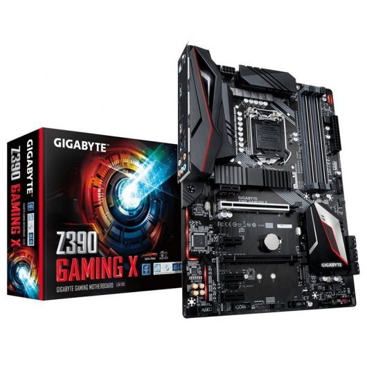 | [Gigabyte Z390 Gaming X](https://www.pccomponentes.com/gigabyte-z390-gaming-x) | 1 | 132,89€ |
|  | [Kingston HyperX Fury Black 2666Mhz 16GB 2X8](https://www.pccomponentes.com/kingston-hyperx-fury-black-16gb-ddr4-2666mhz-pc-21300-2x8gb-cl16) | 1 | 70€ |
| 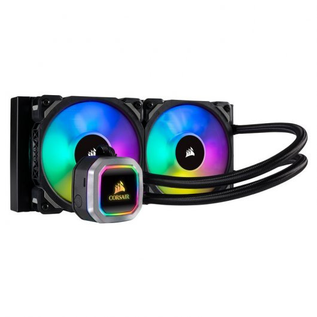 | [Corsair H100i RGB PLATINUM Refrigeración Líquida](https://www.pccomponentes.com/corsair-h100i-rgb-platinum-kit-de-refrigeracion-liquida) | 1 | 137,90€ |
| 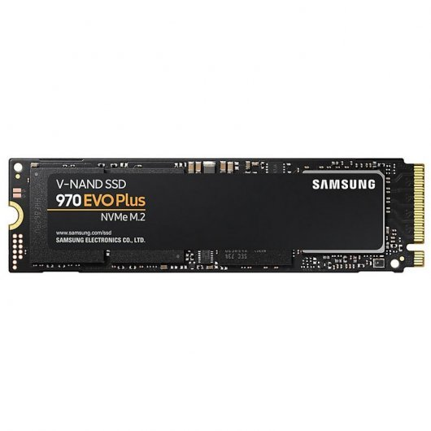 | [Samsung 970 EVO Plus 500GB SSD NVMeM.2](https://www.pccomponentes.com/samsung-970-evo-plus-500gb-ssd-nvme-m2) | 1 | 109,99€ |
| 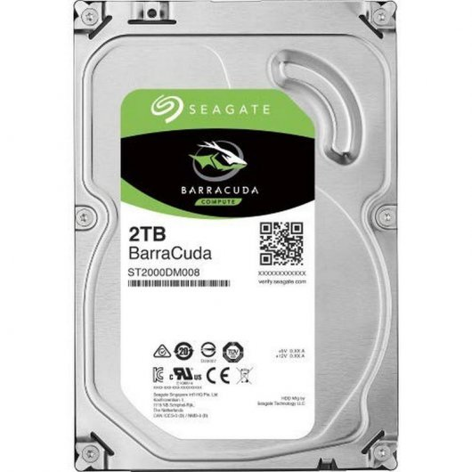 | [Seagate BarraCuda 3.5" 2TB SATA 3](https://www.pccomponentes.com/seagate-barracuda-35-2tb-sata-3) | 1 | 56,98€ |
| 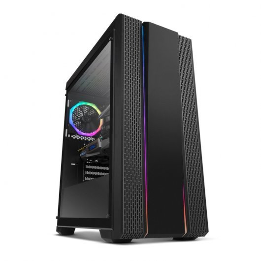 | [NOX Hummer Fusion Cristal Templado USB3.0](https://www.pccomponentes.com/nox-hummer-fusion-cristal-templado-usb-30) | 1 | 69,99€ |
| 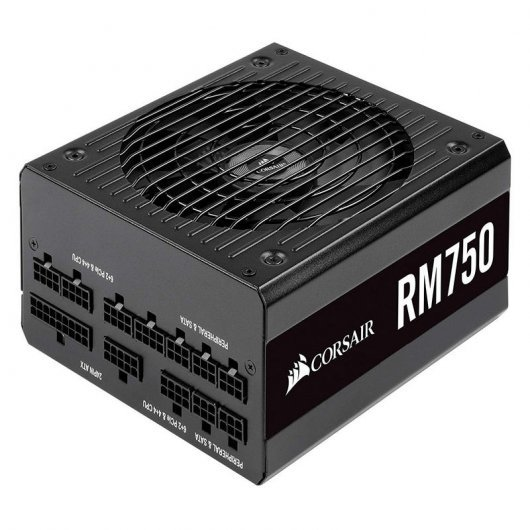 | [CorsairRM750 750W 80 Plus Gold Full Modular](https://www.pccomponentes.com/corsair-rm750-750w-80-plus-gold-full-modular) | 1 | 114,99€ |
| 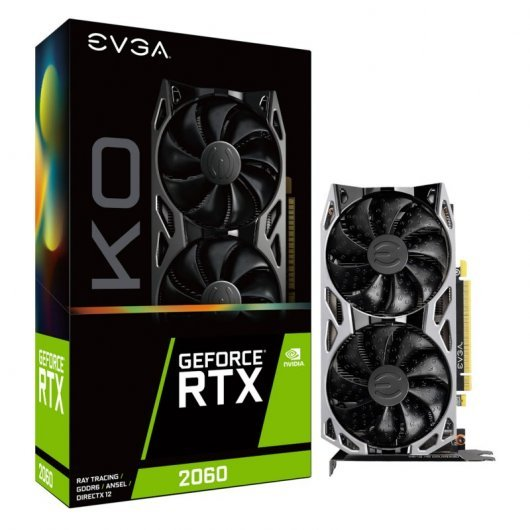 | [EVGA GeForce RTX 2060 KO GAMING 6GB GDDR6](https://www.pccomponentes.com/evga-geforce-rtx-2060-ko-gaming-6gb-gddr6) | 1 | 299,90€ |
| **Total**  |         |        | 1252,54€ |

   

## Perifèrics

| Imatge | Nom | Quantiat | Preu |
|--------|-----|:--------:|:----:|
| 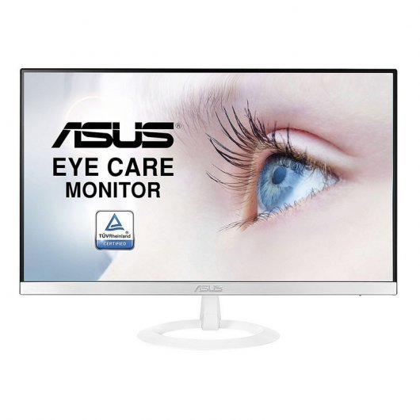 | [Monitor Asus VZ279HE-W 27" LED IPS FullHD ](https://www.pccomponentes.com/monitor-asus-vz279he-w-27-led-ips-fullhd) | 1 | 227,58€ |
| 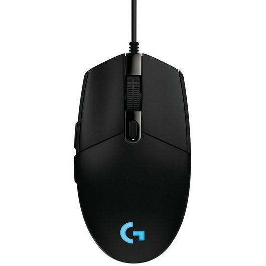 | [Logitech G203 Prodigy Ratón Gaming 8000DPI](https://www.pccomponentes.com/logitech-g203-prodigy-raton-gaming-8000dpi)| 1 | 32,28€ |
| 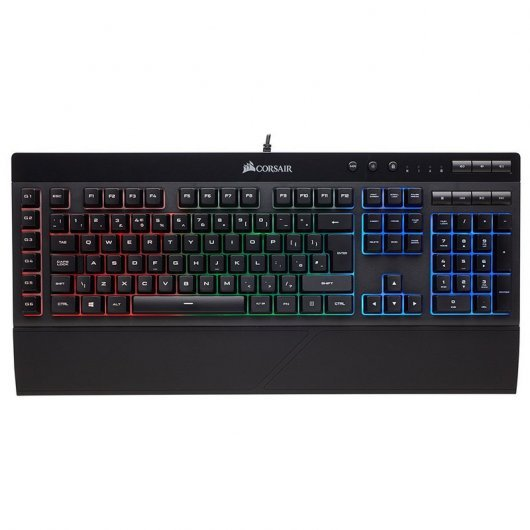 | [Corsair K55 Teclado USB RGB](https://www.pccomponentes.com/corsair-k55-teclado-usb-rgb)| 1 | 59,98€ |
| 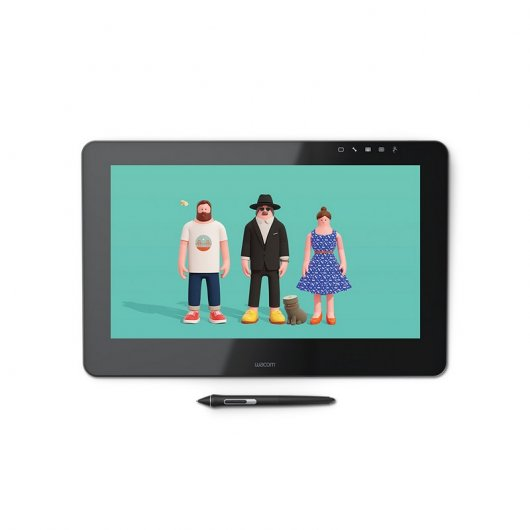 | [Wacom Cintiq Pro 16](https://www.pccomponentes.com/wacom-cintiq-pro-16-uhd-tableta-digitalizadora)| 1 | 1481,78€ |
| **Total** |        |        | 1801,62€ |

   

## Sistema operatitu

| Imatge | Nom | Quantiat | Preu |
|--------|-----|:--------:|:----:|
| 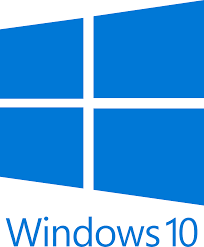 | [Windows 10](https://www.pccomponentes.com/microsoft-windows-10-home-64bits-oem) | 1 | 111,98€|
| **Total** |        |        | 111,98€ |

   

## Descripció components
 

### **Intel Core I79700F:**  
* **Processador**
  * Familia de procesador: 9th gen Intel® Core™ i7
  * Frecuencia del procesador: 3 GHz
  * Número de núcleos de procesador: 8
  * Socket de procesador: LGA 1151 (Zócalo H4)
  * Litografía del procesador: 14 nm
  * Número de filamentos de procesador: 8
  * System bus data transfer rate: 8 GT/s
  * Modo de procesador operativo: 64 bits
  * Caché del procesador: 12 MB
  * Frecuencia del procesador turbo: 4,7 GHz 

* **Memoria**
  * Canales de memoria que admite el procesador: Dual
  * Memoria interna máxima que admite el procesador: 128 GB
  * Tipos de memoria que admite el procesador: DDR4-SDRAM
  * Velocidad de reloj de memoria que admite el procesador: 2666 MHz
  * Ancho de banda de memoria soportada por el procesador (max)  
* **Control de energia**
   * Potencia de diseño térmico (TDP): 65 W
  

### **Gigabyte Z390 Gaming X:** 

 * **Chipset**

   * Intel® Z390 Express Chipset

* **Memory**

   * 4 x DDR4 DIMM sockets supporting up to 64 GB of system memory
  
### **Kingston HyperX**
* **Memoria RAM**
  * Frecuencia: 2666MHz
  * Latencia: CL16
  

### **Corsair H100i RGB**
* **Refrigerción liquida** 
  * Dimensiones: 277mm x 120mm x 27mm
  * Velocidad máxima ventiladores: 2400 RPM
  

### **Samsung 970 EVO Plus 500GB SSD NVMe M.2**  

*  **Característiques** 
   * SDD, capacidad: 500 GB

    

   * Velocidad de lectura: 3500 MB/s

   * Velocidad de escritura: 3200 MB/s
  

### **Seagate BarraCuda 3.5" 2TB SATA 3**  

 * **HDD**
    * Capacidad: 2TB
    * Tamaño del HDD: 3.5"
  

### **NOX Hummer Fusion Cristal Templado USB3.0**
   * **Puertos e Interfaces**
        * Cantidad de puertos USB 2.0: 2
        * Cantidad de puertos tipo A USB 3.0 (3.1 Gen 1): 2
        * Entrada de audio: Si
        * Salida de audio: Si
   * **Diseño**
       *  Factor de forma: Midi-Tower
       *  Formas de factor de tarjeta madre soportadas: ATX,Mini-ITX
  

### **Corsair RM750 750W 80 Plus Gold Full Modular**

 * **Puertos e Interfaces**
      *  Alimentador de energía para tarjeta madre: 20+4 pin ATX
      *  Conectores de poder (4 pin) periferales (Molex): 1
      *  Longitud del cable de alimentación de la placa base: 61 cm
      *  Número de conectores de energía SATA: 10
      *  Número de PATA conectores de alimentación: 4
      *  Longitud del cable de alimentación SATA: 800 mm
      *  Longitud del cable de alimentación periférico (Molex): 750 mm
      *  Conector de energía EPS (8-pin): Si
      *  Conectores de poder PCI Express (6 + 2 pin): 6
      *  Longitud del cable de alimentación PCI Express: 75 cm
      *  Tipo de cableado: Modular  
  
 *   **Control de energía**

      *  Potencia total: 750 W
      * Voltaje de entrada AC: 100 - 240 V
      * Frecuencia de entrada AC: 47 - 63 Hz
      * Corriente de entrada: 10 - 5 A
      * Potencia combinada (3,3 V): 150 W
      * Potencia combinada (+12 V): 750 W
      * Potencia combinada (+5 V): 150 W
      * Potencia combinada (-12V): 3,6 W
      * Potencia combinada (+5 VSB): 15 W
      * Corriente máxima de salida (+3.3V): 20 A
      * Corriente máxima de salida (+12V): 62,5 A
      * Corriente máxima de salida (+5V): 20 A
      * Corriente máxima de salida (-12V): 0,3 A
      * Corriente máxima de salida (+5Vsb): 3 A
      

### **EVGA GeForce RTX 2060 KO GAMING 6GB GDDR6**
* **Procesador**
  * CUDA: Si
  * Núcleos CUDA: 1920
  * Familia de procesadores de gráficos: NVIDIA
  * Procesador gráfico: GeForce RTX 2060
  * Aumento de la velocidad de reloj del procesador: 1680 MHz
* **Memoria**
  * Capacidad memoria de adaptador gráfico: 6 GB
  * Tipo de memoria de adaptador gráfico: GDDR6
  * Ancho de datos: 192 bit
  * Velocidad de memoria del reloj: 14000 MHz
  * Ancho de banda de memoria (max): 336 GB/s
*  **Control de energia**
   * Suministro de energía al sistema mínimo: 500 W
   * Consumo energético: 160 W
   * Conectores de energia suplementario: 1x 8-pin
  
## Descripció perifèrics
### **Monitor Asus VZ279HE-W 27" LED IPS FullHD**

 * **Exhibició**
   * Resolución de la pantalla: 1920 x 1080 Pixeles
   * Pantalla: LED
   * Tipo HD: Full HD
 * **Puertos e Interfaces**
   *  Conector USB incorporado: No
   *  Cantidad de puertos VGA (D-Sub): 1
   *  Puerto DVI: No
   *  Número de puertos HDMI: 2
    
  
### **Logitech G603 Ratón Gaming Inalámbrico 12000DPI**
 * **Especificaciones técnicas**
   * Resolución: 200 ? 12.000 dpi
   * Durabilidad
     * Botones (izquierdo/derecho): 20 millones de clics 
  

### **Corsair K55 Teclado USB RGB**
 * **Teclado** 
   * Interruptor del teclado: Interruptor de membrana
   * Tiempo de respuesta clave (mín.): 1 ms
  

### **Wacom Cintiq Pro 16 UHD Tableta Digitalizadora**
* Característiques
  * Rendiment avançat 
  * Sensibilitat de presió
  * Claridad: pantalla d'alta resolució, qualitat cromática
* Peso y dimensiones
  * Ancho: 410 mm
  * Profundidad: 265 mm
  * Altura: 17,5 mm
  * Peso de tableta: 1,5 kg
* Tableta
  * Tecnología de conectividad: Alámbrico
  * Resolución: 5080
  * Área de trabajo: 294 x 166 mm
  * Interfaz del dispositivo: USB
  * Tipo de entrada de tableta: Pluma
* Pluma
  * Bolígrafo incluido: Si
  * Pluma inalámbrica: Si
  * Nivel de presión: 8192
  * Pluma libre de batería: Si
  * Mangos de goma: Si
  

### **Descripció del pressupost**

El processador que hem escollit ha sigut aquet ja que la gama F es més barat, perquè al tenir el chip gràfic podem prescindir d'aquest chip ja que fiquem una tarjeta gràfica dedicada.

Hem escollit dos moduls de RAM de 8GB cada un ja que així obtindrem més rendiment amb la tecnologia dual channel.

Hem escollit refrigeració liquida per tenir l'ordinador a baixes temperatures, sobretot als moment de renderització.

La tarjeta gràfica que hem escollit la RTX 2060 per la seva potència i el dia que vam realitzar el pressupost estava rebaixada de preu. Principalment haviem escollit una GTX 1660 però al veure la oferta de la RTX 2060 per la petita diferència de preu i estant dins del pressupost establert hem decidit agafar la RTX 2060.

De monitors hem escollit simplement un de 27 polzades amb resolució full HD. Només hem escollit un ja que tenim una tableta gràfica que també fa de pantalla.

De sistema operatiu hem elegit Windows 10 ja que pels programes d'Adobe hi ha millor compatibilitat.

