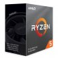
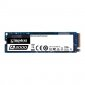

# Pressupost 4 - Compositor i productor

## 1. Components

| Imatge | Nom | Preu | Descripció |
| ------ | --- | ---- | ---------- |
|  | AMD Ryzen 5 3600 | 202,90€ | Nuclis de CPU: 6 Cores / 12 fils   Frequéncia de CPU 3.6GHz fins 4.2GHz en turbo |
|  | MSI B450 Gaming Plus MAX | 97,99€ | Socket AM4   Chispet AMD B450 |
|  | Kingston HyperX Fury Black | 70€ | 16GB DDR4 3200Mhz (2x8GB) CL16 |
|  | Corsair Cooling Hydro Series H45 | 41,99€ | Disipador liquid amb un radiador de 120mm
|  | Kingston A200 M.2 | 67,33€ | Kingston M.2 de 500GB PCI-Express NVMe Velocitat de lectura/escritura: 2.200/2.000MB/s |
|  | Segate BarraCuda 3.5" 1TB SATA3 | 35,95€ | Velocitat de rotació 7200RPM   Tamany de 3.5"   Tamany búfer de 64MB |
|  | 
|  | EVGA W1 600W 80 Plus | 49,99 | 
|  | AsRock Phantom Gaming D | 189,90€ |  Radeon RX580 OC 8GB GDDR5 
|  | Creative Sound Blaser Audigy RX | 51€ | Grabaciones de audio de latencia superbaja
|  | Tacens Anima ACR1 | 4,25€ | 6 puertos de tarjetas para más de 68 tipos de tarjetas 
|  | Asus DRW-24D5MT | 16,65€ | Velocidad de escritura DVD 24X 
| | Preu total: | |

  
  
## 2. Perifèrics

## 3. Justificació
