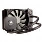
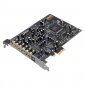

# Pressupost 4 - Compositor i productor

## 1. Components
 

| Imatge | Nom | Preu | Descripció |
| ------ | --- | ---- | ---------- |
|  | AMD Ryzen 5 3600 | 202,90€ | Nuclis de CPU: 6 Cores / 12 fils   Frequéncia de CPU 3.6GHz fins 4.2GHz en turbo |
|  | MSI B450 Gaming Plus MAX | 97,99€ | Socket AM4 Chispet AMD B450 Format ATX Audio de 8 canals (7.1) Audio HD amb reforç de sò Compte amb les tecnologies: Core Boost, Audio Boost, DDR4 Boost | 
|  | Kingston HyperX Fury Black | 70€ | 16GB DDR4 3200Mhz (2x8GB) CL16 |
|  | Corsair Cooling Hydro Series H45 | 41,99€ | Disipador liquid amb un radiador de 120mm
|  | Kingston A200 M.2 | 67,33€ | Kingston M.2 de 500GB PCI-Express NVMe Velocitat de lectura/escritura: 2.200/2.000MB/s |
|  | Segate BarraCuda 3.5" 1TB SATA3 | 35,95€ | Velocitat de rotació 7200RPM   Tamany de 3.5"   Tamany búfer de 64MB |
|  | MSI MAG Forge 100M Cristal Templado RGB | 44,99€ | Capacitat per instalar 6 ventiladors  Controlador de 1 a 6 RGB LED Disseny de vidre templerat de 4mm de gruix de primera calitat Filtre magnètic a la part superior |
|  | EVGA W1 600W 80 Plus | 49,99 | Tipo de cable no modular  Certificació 80 Plus Silver
|  | AsRock Phantom Gaming D | 189,90€ |  Radeon RX580 OC 8GB GDDR5 
|  | Creative Sound Blaser Audigy RX | 51€ | Grabaciones de audio de latencia superbaja
|  | Tacens Anima ACR1 | 4,25€ | 6 puertos de tarjetas para más de 68 tipos de tarjetas 
|  | Asus DRW-24D5MT | 16,65€ | Velocidad de escritura DVD 24X 
| | **Preu total:** | **901.60€** |
    

## 2. Perifèrics
 

| Imatge | Nom | Preu | Descripció |
| ------ | --- | ---- | ---------- |
|  | BenQ GW2780E 27" | 149€ | Pantalla Full HD 27"  Fuente de alimentació (90-264 AC)
|  | Owlotech Combo 101 (Teclat+ Ratoli) | 16,95€ | Conexión 2.4Ghz, 1 receptor nano per ambdos productes  Resolució: 800/1200/1600 DPI
|  | Logitech Z333 Speaker 80W | 44,99€ | 40 vatts (RMS)/80 vatts cresta  RCA estéreo y 3,5mm     
| | **Preu total:** | **210,94€** |
    

## 3. Justificació

### Link de la configuració
[Enllaç de la Configuració del PC](https://www.pccomponentes.com/configurador/D224D3824)