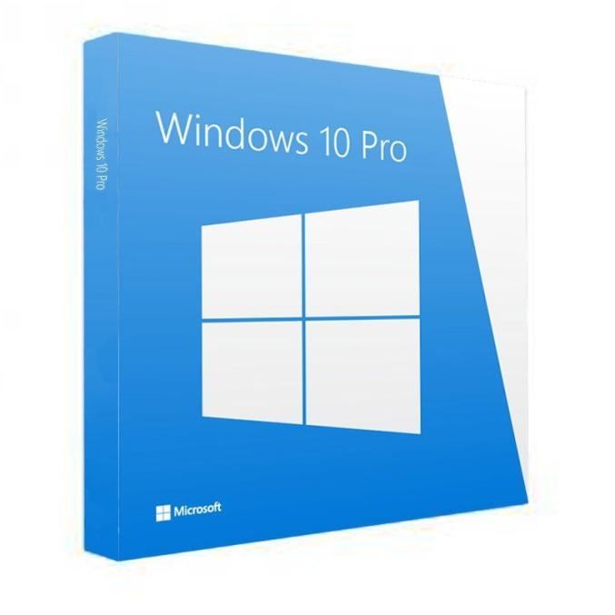

# **Pressupost 2. Gamer.**

## **Configuració de l'ordinador**

| Imatge |  | Nom | Preu | Característiques | Motiu elecció
|---------|---------|---------|---------|---------|---------|
|  | **Processador** | AMD Ryzen 7 3700X 3.6GHz BOX | 319,90€ |   -Socket: AM4    -Nuclis: 8    -Fils: 16    -Velocitat: 3.6GHz    | Els processadors AMD Ryzen son molt bons per a ordinadors d'aquest tipus. Aquest processador era el millor per al pressupost que teníam.
|  | **Placa Base** | Gigabyte X570 Aorus Ultra | 299,90€ |   -Socket: AM4    -Chipset: AMD X570    | Tenía un socket AM4, compatible amb el processador AMD Ryzen 7. Ademés 
|  | **Memoria RAM** | Corsair Vengeance LPX DDR4 3200 PC4-25600 32GB 2x16GB CL16 | 154,99€ |   -Memoria interna: 32GB    -Tipus de memoria interna: DDR4    | Motiu 
   | **Ventilador CPU** | Corsair Hydro H60 Kit de Refrigeración Líquida | 79,94€ |  -Socket: AM4    -Chipset: AMD X570     | Motiu
|  | **Disc dur 1** | Samsung 860 EVO Basic SSD 500GB SATA3 | 76€ |    -Capacitat: 500 GB.    -Tipus: SSD   | Motiu
   | **Disc dur 2** | Seagate BarraCuda 3.5" 2TB SATA 3 | 56,98€ |  -Capacitat: 2000 GB    -Tipus: HDD     | Motiu
|  | **Torre** | Nfortec Krater Cristal Templado USB 3.0 ARGB Negro | 79,90€ |   -Ventilador: 3     | Motiu
   | **Font d'alimentació** | Aerocool LUX 650M RGB 650W Bronze Semi-Modular | 59,98€ |   -Capacitat: 500 GB.    -Tipus: SSD   | Motiu
|  | **Targeta gràfica** | Gigabyte GeForce GTX 1660 Super Gaming OC 6GB GDDR6 | 255,90€ |  -Capacitat: 500 GB.    -Tipus: SSD    | Motiu
   | **Monitor** | AOC Gaming 24G2U 24" LED IPS FullHD 144Hz FreeSync | 189,99€ |   -Capacitat: 500 GB.    -Tipus: SSD   | Motiu
|  | **Teclado** | Newskill Suiko Teclado Mecánico Gaming Full RGB Switch Kailh Red| 69,95€ |   -Capacitat: 500 GB.    -Tipus: SSD   | Motiu
   | **Ratolí** | Newskill EOS Ratón Gaming Professional RGB 16000DPI| 49,95€ |   -Capacitat: 500 GB.    -Tipus: SSD    | Motiu
   | **Sistema Operatiu** |Microsoft Windows 10 Pro Standard 32/64Bits (Requiere Montaje PcCom + Instalación S.O.) | 132 € |   -Capacitat: 500 GB.    -Tipus: SSD   | Motiu

### **Preu final**

* **Components**
  * Processador: 319,90€
  * Placa base: 299,90€
  * RAM: 154,99€
  * Ventilador: 79,94€
  * Disc dur: 76€
  * Disc dur 2: 56,98€
  * Caixa: 79,90€
  * Alimentació: 59,98€
  * Gràfica: 255,90
  * **Total:** 1383,49€
  
* **Periférics**
  * Monitor: 189,99€
  * Teclat: 69,95€
  * Ratolí: 49,95€
  * **Total:** 309,89€
  
* **Sistema Operatiu**
  * Microsoft Windows 10 Pro Standard
  * **Total:** 132€

* **TOTAL:** 1825,38€
   
   
  Preus agafats a data 22/10/2020

